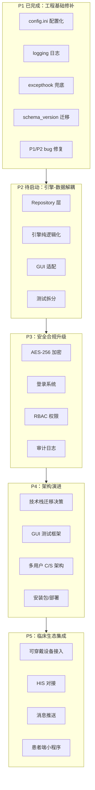
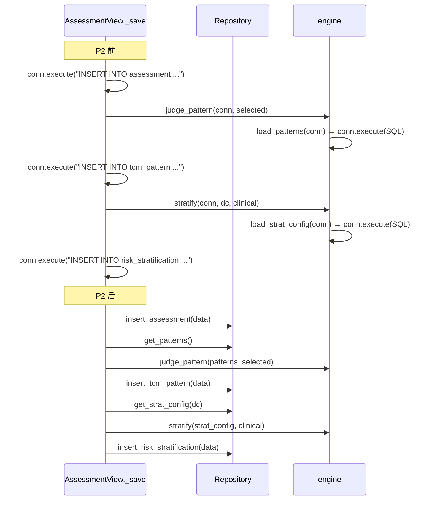
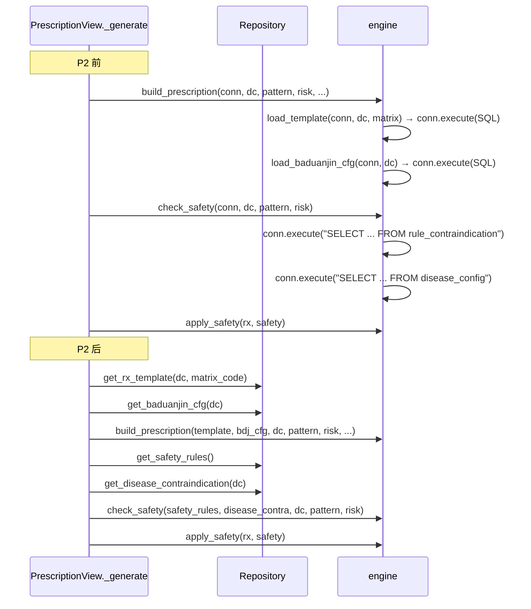
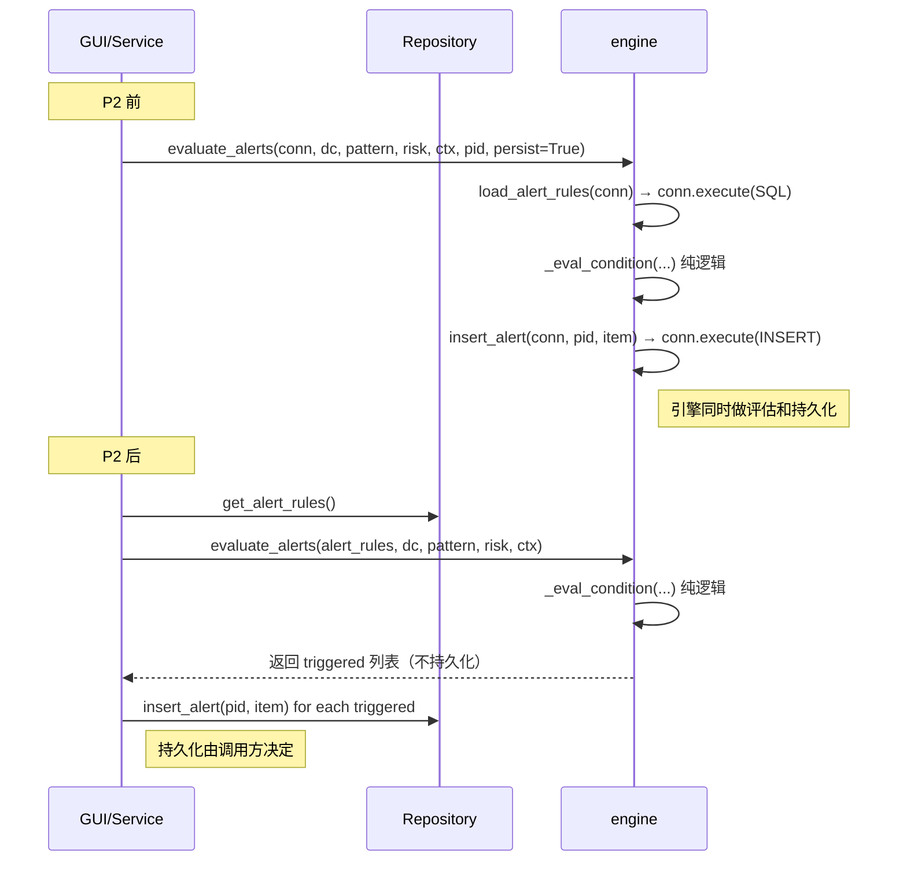
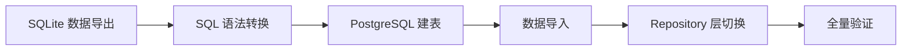
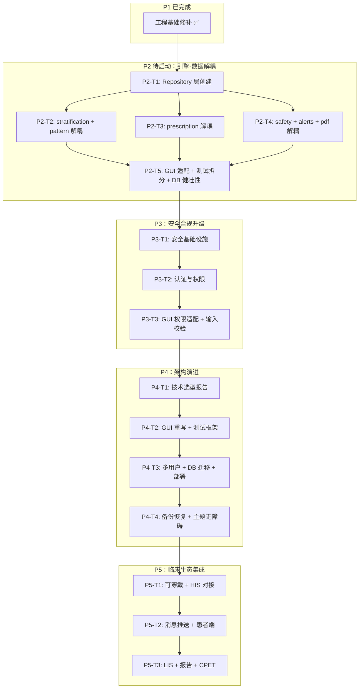

# 分阶段开发设计与任务列表

> 项目：中西医结合心血管康复方案包与数字化全程管理系统
> 编制：高见远（Bob，架构师）｜ 日期：2026-08-03
> 依据：分阶段开发 PRD、代码验收报告、架构问题分析报告、设计方案 v0.2、.hermes.md 项目规则
> 技术栈：Python 3.13 / tkinter / SQLite / 中文 UI / 规则外置 / 多病种架构 / 医师签发必经

---

## 目录

- [一、总体架构演进图](#一总体架构演进图)
- [二、P1：工程基础修补（✅ 已完成）](#二p1工程基础修补-已完成)
- [三、P2：引擎-数据解耦（最详细）](#三p2引擎-数据解耦最详细)
- [四、P3：安全合规升级（中等详细）](#四p3安全合规升级中等详细)
- [五、P4：架构演进（框架性设计）](#五p4架构演进框架性设计)
- [六、P5：临床生态集成（概要设计）](#六p5临床生态集成概要设计)
- [七、依赖包列表](#七依赖包列表)
- [八、共享知识（跨文件约定）](#八共享知识跨文件约定)
- [九、待明确事项](#九待明确事项)
- [十、任务依赖图](#十任务依赖图)

---

## 一、总体架构演进图

### 1.1 架构演进全貌



### 1.2 分层架构变化对比

```
P1/P2 前（当前）：               P2 后：                        P4 后（目标）：
┌──────────┐                    ┌──────────┐                   ┌──────────┐
│  GUI 层   │                    │  GUI 层   │                   │  GUI 层   │
│ (tkinter)│                    │ (tkinter)│                   │(PySide6/ │
│  ↓ conn  │                    │  ↓ repo  │                   │  Web)    │
├──────────┤                    ├──────────┤                   ├──────────┤
│ Engine 层 │                    │ Service  │                   │ API 层   │
│  ↓ conn  │                    │ (编排)   │                   │(FastAPI) │
├──────────┤                    ├──────────┤                   ├──────────┤
│  DB 层   │                    │ Engine 层 │                   │ Engine 层 │
│ (conn +  │                    │ (纯逻辑)  │                   │ (纯逻辑)  │
│  DAO)    │                    ├──────────┤                   ├──────────┤
└──────────┘                    │Repo 层   │                   │Repo 层   │
                                │(数据访问)│                   │(PG/SQL)  │
                                ├──────────┤                   └──────────┘
                                │  DB 层   │
                                │ (conn)  │
                                └──────────┘
```

### 1.3 数据流变化对比

```
P2 前（当前调用链）：
  GUI 回调 → engine.func(conn, ...) → conn.execute("SQL")
  GUI 回调 → db.insert_row(conn, ...) → conn.execute("SQL")

P2 后（目标调用链）：
  GUI 回调 → repo.get_data() → engine.pure_func(data) → repo.save_result(result)
  引擎不碰 conn，不执行 SQL，接收 dict 返回 dict
```

---

## 二、P1：工程基础修补（✅ 已完成）

### 2.1 完成状态

P1 已于 2026-08-03 完成并通过全量验收。核心交付物：

| 交付物 | 状态 | 说明 |
|--------|------|------|
| P1 bug 修复（4 项） | ✅ | Entry.set() 崩溃、simpledialog 未导入、保存字段不完整、consecutive_met 未实现 |
| P2 改进（7 项） | ✅ | 键名统一、disease_category 动态读取、PK 过滤修正、死代码清理等 |
| requirements.txt | ✅ | reportlab>=4.0 |
| config.ini + config.py | ✅ | 数据库路径、加密密钥、医院名称从配置读取 |
| logging 日志模块 | ✅ | 统一日志落 data/logs/rehab.log |
| 全局异常处理 | ✅ | sys.excepthook 兜底 + 崩溃日志 |
| schema_version 迁移 | ✅ | schema_version 表 + MIGRATIONS 列表 |
| GUI 逻辑层测试 | ✅ | 7 用例覆盖 4 个 P1 修复路径 |

### 2.2 当前代码基线

| 模块 | 文件数 | 行数 | 质量评级 |
|------|--------|------|---------|
| 引擎层（engine/） | 6 | 612 | A 级 |
| GUI 层（ui/） | 6 | 1071 | B+ 级 |
| DB 层（db.py） | 1 | 443 | A 级 |
| 基础设施（config.py, log.py） | 2 | ~120 | ✅ |
| 测试（test/） | 3 | 361 | A 级 |
| **合计** | **18** | **~2607** | — |

**全量测试**：33 用例（引擎 25 + e2e 1 + GUI 7），0 FAIL。

### 2.3 保留的核心优势（重构时不可丢失）

1. 规则外置到数据库（不硬编码阈值/模板/禁忌）
2. 缺数据保守判高危（医疗安全取向）
3. 医师签发不可跳过（"临床决策支持工具"定位）
4. 矩阵编码 A1-F3（双轴索引）
5. 无 CPET 处方路径（RPE 主导 + HRR 校验）
6. 预警闭环设计（触发→处置→关闭留痕）

---

## 三、P2：引擎-数据解耦（最详细）

### 3.1 实现方案

#### 核心问题

当前引擎层 6 个文件中，**5 个函数族直接接收 `conn` 参数执行 SQL**，导致：
- 引擎无法脱离 DB 做纯逻辑单元测试
- 换数据库要改引擎代码
- GUI 层做领域决策（硬编码 disease_category）

#### 解耦策略

引入 **Repository 层**（`app/repo.py`），集中全部数据访问。引擎函数改为接收 dict、返回 dict，不碰 `conn`。

```
P2 后调用链：
  GUI 回调 → repo.get_xxx() → engine.pure_func(data) → repo.save_xxx(result)
```

#### 技术选型理由

| 决策 | 选择 | 理由 |
|------|------|------|
| Repository 层位置 | 单文件 `app/repo.py` | 项目规模小（17 表），单文件起步，后续按需拆分 |
| 是否引入 Service 层 | 暂不引入 | GUI 直接编排 repo + engine，保持简单；P3/P4 按需引入 |
| 加密/解密归属 | Repository 层 | GUI 和 Engine 不感知加密，repo 透明处理 |
| 迁移策略 | 逐函数迁移 | 每改一个引擎函数跑全量测试，降低风险 |

### 3.2 当前引擎函数 conn 使用审查

#### 接 conn 的函数清单（需改造）

| 文件 | 函数 | 当前签名 | conn 用途 |
|------|------|---------|----------|
| `stratification.py` | `load_strat_config` | `(conn, disease_category) -> dict` | `SELECT strat_threshold_json FROM disease_config` |
| `stratification.py` | `stratify` | `(conn, disease_category, clinical) -> (str, list)` | 调 `load_strat_config(conn, ...)` |
| `pattern.py` | `load_patterns` | `(conn) -> list` | `SELECT pattern_name, features_json FROM rule_tcm_pattern` |
| `pattern.py` | `judge_pattern` | `(conn, selected_items) -> (str, str, dict)` | 调 `load_patterns(conn)` |
| `prescription.py` | `load_template` | `(conn, disease_category, matrix) -> dict` | `SELECT output_json FROM rule_rx_template` |
| `prescription.py` | `load_baduanjin_cfg` | `(conn, disease_category) -> dict` | `SELECT baduanjin_start_json FROM disease_config` |
| `prescription.py` | `build_prescription` | `(conn, disease_category, pattern, ...) -> dict` | 调 `load_template(conn)`, `load_baduanjin_cfg(conn)` |
| `safety.py` | `check_safety` | `(conn, disease_category, pattern, risk_level) -> dict` | `SELECT ... FROM rule_contraindication` + `disease_config` |
| `alerts.py` | `load_alert_rules` | `(conn) -> list` | `SELECT ... FROM rule_alert WHERE enabled=1` |
| `alerts.py` | `evaluate_alerts` | `(conn, disease_category, ..., persist=False) -> list` | 调 `load_alert_rules(conn)`, 可能调 `insert_alert(conn)` |
| `alerts.py` | `insert_alert` | `(conn, patient_id, item) -> int` | `INSERT INTO alert` |
| `alerts.py` | `pending_alerts` | `(conn, level=None) -> list` | `SELECT * FROM alert WHERE ...` |
| `alerts.py` | `close_alert` | `(conn, alert_id, handler, content) -> None` | `UPDATE alert SET ...` |
| `pdf_export.py` | `export_rx_pdf` | `(conn, rx, out_path) -> str` | `SELECT name_enc, gender FROM patient` |

#### 已是纯逻辑的函数（无需改造）

| 文件 | 函数 | 说明 |
|------|------|------|
| `stratification.py` | `_met_capacity_from_6mwd` | 纯计算 |
| `stratification.py` | `_norm` | 纯 dict 处理 |
| `stratification.py` | `_eval_condition` | 纯条件判定 |
| `prescription.py` | `matrix_code` | 纯编码映射 |
| `prescription.py` | `phase_adjust` | 纯阶段适配 |
| `prescription.py` | `calc_target_hr` | 纯心率计算 |
| `prescription.py` | `progression_decision` | 纯进阶/降级判定 |
| `safety.py` | `_match` | 纯规则匹配 |
| `safety.py` | `apply_safety` | 纯处方安全应用 |
| `alerts.py` | `_applicable` | 纯适用范围过滤 |
| `alerts.py` | `_eval_condition` | 纯条件判定 |
| `alerts.py` | `_notify_target` | 纯通知目标格式化 |
| `alerts.py` | `_consecutive` | 纯序列检查 |

### 3.3 文件列表

| 文件 | 操作 | 职责 |
|------|------|------|
| `app/repo.py` | **新增** | Repository 层：集中全部 SQL + 加密/解密 |
| `app/engine/stratification.py` | 修改 | `stratify` 移除 conn，接收 `strat_config: dict` |
| `app/engine/pattern.py` | 修改 | `judge_pattern` 移除 conn，接收 `patterns: list` |
| `app/engine/prescription.py` | 修改 | `build_prescription` 移除 conn，接收 `template: dict, baduanjin_cfg: dict` |
| `app/engine/safety.py` | 修改 | `check_safety` 移除 conn，接收 `safety_rules: list, disease_contra: dict` |
| `app/engine/alerts.py` | 修改 | `evaluate_alerts` 移除 conn，接收 `alert_rules: list`；持久化函数移到 repo |
| `app/engine/pdf_export.py` | 修改 | `export_rx_pdf` 移除 conn，接收 `patient_info: dict` |
| `app/ui/main.py` | 修改 | 新增 `self.repo = Repository(conn)`，传给各视图 |
| `app/ui/patient_view.py` | 修改 | `self.conn` → `self.repo`，所有回调改用 repo |
| `app/ui/assessment_view.py` | 修改 | 同上，引擎调用改为传 data 而非 conn |
| `app/ui/prescription_view.py` | 修改 | 同上 |
| `app/ui/followup_view.py` | 修改 | 同上 |
| `app/ui/rules_view.py` | 修改 | `self.conn` → `self.repo`，用 repo 通用方法 |
| `test/test_engine.py` | 修改 | 拆分：纯逻辑测试（无 DB）+ 集成测试（repo 带 DB） |
| `test/test_e2e.py` | 修改 | 适配新签名（repo + 纯函数） |
| `test/test_gui.py` | 修改 | 适配新签名 |
| `test/test_engine_pure.py` | **新增** | 纯逻辑单元测试（构造 dict，无 DB） |
| `test/test_repo.py` | **新增** | Repository 集成测试（带 DB） |

### 3.4 数据结构和接口

#### 3.4.1 Repository 层接口（`app/repo.py`）

```python
class Repository:
    """集中全部数据访问。引擎不碰 conn。加密/解密在此层透明处理。"""

    def __init__(self, conn=None):
        """conn 可注入（测试用），默认从 db.get_conn() 获取。"""

    # ---- 规则数据读取（只读，可缓存）----

    def get_strat_config(self, disease_category: str) -> dict:
        """读取病种危险分层参数集（解析 JSON）。"""

    def get_patterns(self) -> list[dict]:
        """读取全部启用证型特征库（已解析 keywords/symptoms/tongue/pulse）。"""

    def get_pattern_names(self) -> list[str]:
        """读取全部证型名列表。"""

    def get_pattern_keywords(self) -> list[str]:
        """读取全部证型 keywords（去重保序，用于生成四诊问卷）。"""

    def get_rx_template(self, disease_category: str, matrix_code: str) -> dict:
        """调取处方模板（II 期基线模板，解析 JSON）。"""

    def get_baduanjin_cfg(self, disease_category: str) -> dict:
        """读取八段锦参数集（起始映射/升降级/阶段角色）。"""

    def get_safety_rules(self) -> list[dict]:
        """读取全部启用禁忌规则（rule_contraindication 表）。"""

    def get_disease_contraindication(self, disease_category: str) -> dict:
        """读取病种特异禁忌（disease_config.contraindication_json）。"""

    def get_alert_rules(self) -> list[dict]:
        """读取全部启用预警规则（rule_alert 表）。"""

    def get_followup_template(self, disease_category: str) -> list[dict]:
        """读取随访节点模板（disease_config.followup_template_json）。"""

    def get_enabled_diseases(self) -> list[str]:
        """读取启用的病种列表。"""

    # ---- Patient CRUD（加密在此层透明处理）----

    def list_patients(self) -> list[dict]:
        """患者列表（解密后返回 name/contact 明文）。"""

    def get_patient(self, patient_id: int) -> dict | None:
        """读取单个患者（解密 name/contact）。"""

    def get_patient_disease_category(self, patient_id: int) -> str:
        """读取患者病种（分层/处方用）。"""

    def get_patient_for_pdf(self, patient_id: int) -> dict:
        """读取患者信息（PDF 导出用，解密 name）。"""

    def insert_patient(self, data: dict) -> int:
        """新建患者（自动加密 name/contact）。data 含 name/contact 明文。"""

    def update_patient(self, patient_id: int, data: dict) -> None:
        """更新患者（自动加密）。"""

    def delete_patient(self, patient_id: int) -> None:
        """删除患者（含手术信息）。"""

    # ---- Procedure ----

    def get_procedure(self, patient_id: int) -> dict | None:
        """读取最新手术信息。"""

    def get_procedure_complete_revasc(self, patient_id: int) -> bool:
        """读取完全血运重建标志（分层用）。"""

    def get_procedure_id(self, patient_id: int) -> int | None:
        """读取最新 procedure_id（更新用）。"""

    def insert_procedure(self, data: dict) -> int:
        """新建手术记录。"""

    def update_procedure(self, procedure_id: int, data: dict) -> None:
        """更新手术记录。"""

    # ---- Assessment ----

    def list_assessments(self, patient_id: int) -> list[dict]:
        """评估历史列表（LEFT JOIN 最新分层）。"""

    def get_assessment(self, assessment_id: int) -> dict | None:
        """读取单条评估。"""

    def get_latest_phq9(self, patient_id: int) -> int | None:
        """读取最新 PHQ-9（处方预览用）。"""

    def insert_assessment(self, data: dict) -> int:
        """新建评估记录。"""

    # ---- TCM Pattern ----

    def get_latest_confirmed_pattern(self, patient_id: int) -> str | None:
        """读取最新医师确认的证型。"""

    def get_tcm_pattern_by_date(self, patient_id: int, assess_date: str) -> dict | None:
        """按日期读取证型记录。"""

    def insert_tcm_pattern(self, data: dict) -> int:
        """新建证型记录。"""

    # ---- Risk Stratification ----

    def get_latest_risk_level(self, patient_id: int) -> str | None:
        """读取最新分层结果。"""

    def insert_risk_stratification(self, data: dict) -> int:
        """新建分层记录。"""

    # ---- Prescription ----

    def list_prescriptions(self, patient_id: int) -> list[dict]:
        """处方历史列表。"""

    def get_prescription(self, rx_id: int) -> dict | None:
        """读取单条处方。"""

    def insert_prescription(self, data: dict) -> int:
        """新建处方（草稿）。"""

    def update_prescription(self, rx_id: int, data: dict) -> None:
        """更新处方（全字段）。"""

    # ---- Follow-up ----

    def list_followups(self, patient_id: int) -> list[dict]:
        """随访计划列表。"""

    def list_due_followups(self) -> list[dict]:
        """到期提醒列表（待随访状态）。"""

    def get_followup(self, fu_id: int) -> dict | None:
        """读取单条随访。"""

    def list_existing_fu_types(self, patient_id: int) -> list[str]:
        """读取已有随访类型（避免重复生成）。"""

    def insert_followup(self, data: dict) -> int:
        """新建随访计划。"""

    def update_followup_status(self, fu_id: int, actual_date: str,
                                handler: str, record_json: str) -> None:
        """标记随访完成。"""

    def get_day0(self, patient_id: int) -> str | None:
        """Day 0：手术日期优先，其次建档日期。"""

    # ---- Alert ----

    def insert_alert(self, patient_id: int, item: dict) -> int:
        """写入预警记录（状态=待处置）。"""

    def list_pending_alerts(self, level: str = None) -> list[dict]:
        """待处置预警列表。"""

    def close_alert(self, alert_id: int, handler: str, handle_content: str) -> None:
        """处置并关闭预警（闭环留痕）。"""

    # ---- 通用 DAO（rules_view.py 等需要）----

    def query_all(self, sql: str, params: tuple = ()) -> list[dict]:
        """通用查询（返回 dict 列表）。"""

    def query_one(self, sql: str, params: tuple = ()) -> dict | None:
        """通用单行查询。"""

    def insert_row(self, table: str, data: dict) -> int:
        """通用插入。"""

    def update_row(self, table: str, data: dict, where: str, params: tuple) -> None:
        """通用更新。"""
```

#### 3.4.2 引擎函数新签名

```python
# stratification.py — 移除 load_strat_config（移到 repo）
def stratify(strat_config: dict, clinical: dict) -> tuple[str, list]:
    """
    执行危险分层。纯逻辑，无 conn。
    参数：
      strat_config: 分层参数集 dict（由 repo.get_strat_config() 获取）
      clinical: 临床指标 dict（LVEF / met_capacity / six_mwd ...）
    返回：(risk_level, triggered)
    """

# pattern.py — 移除 load_patterns（移到 repo）
def judge_pattern(patterns: list, selected_items: list) -> tuple[str, str, dict]:
    """
    证型判定。纯逻辑，无 conn。
    参数：
      patterns: 证型特征库列表（由 repo.get_patterns() 获取）
      selected_items: 四诊问卷勾选条目文本列表
    返回：(main, secondary, scores)
    """

# prescription.py — 移除 load_template, load_baduanjin_cfg（移到 repo）
def build_prescription(template: dict, baduanjin_cfg: dict,
                       disease_category: str, pattern: str, risk_level: str,
                       phase: str = "II", week_no: int = 1,
                       resting_hr=None, max_hr=None, age=None,
                       on_beta_blocker=False,
                       gen_date=None, valid_days: int = 14) -> dict:
    """
    生成结构化康复处方。纯逻辑，无 conn。
    参数：
      template: 处方模板 dict（由 repo.get_rx_template() 获取）
      baduanjin_cfg: 八段锦参数集（由 repo.get_baduanjin_cfg() 获取）
    返回：处方 dict（对应 prescription 表字段，status='草稿'）
    """

# safety.py — check_safety 改造
def check_safety(safety_rules: list, disease_contra: dict,
                 disease_category: str, pattern: str, risk_level: str) -> dict:
    """
    执行安全校验。纯逻辑，无 conn。
    参数：
      safety_rules: 禁忌规则列表（由 repo.get_safety_rules() 获取）
      disease_contra: 病种特异禁忌 dict（由 repo.get_disease_contraindication() 获取）
    返回：{'blocked': [...], 'warnings': [...]}
    """
# apply_safety 不变（已是纯逻辑）

# alerts.py — evaluate_alerts 改造，移除持久化函数（移到 repo）
def evaluate_alerts(alert_rules: list, disease_category: str,
                    pattern: str, risk_level: str, ctx: dict) -> list:
    """
    评估全部启用的预警规则，返回触发列表。纯逻辑，无 conn。
    参数：
      alert_rules: 预警规则列表（由 repo.get_alert_rules() 获取）
      ctx: 预警上下文 dict
    返回：[ {rule_code, level, name, trigger_data, notify_target} ... ]
    注意：不再持久化。持久化由调用方通过 repo.insert_alert() 完成。
    """
# 移除 load_alert_rules, insert_alert, pending_alerts, close_alert（移到 repo）

# pdf_export.py — 移除 conn
def export_rx_pdf(patient_info: dict, rx: dict, out_path: str) -> str:
    """
    导出处方单 PDF。无 conn。
    参数：
      patient_info: {'name': str, 'gender': str, 'birth_date': str}
                    （由 repo.get_patient_for_pdf() 获取）
      rx: 处方 dict
      out_path: 输出路径
    返回：out_path
    """
```

#### 3.4.3 GUI 层调用方式变化

| 视图 | 回调 | P2 前（conn 直连） | P2 后（repo + engine） |
|------|------|-------------------|----------------------|
| `patient_view` | `_save` | `encrypt_text(name)` → `insert_row(conn, "patient", ...)` | `repo.insert_patient({"name": name, ...})` |
| `patient_view` | `_load_form` | `conn.execute("SELECT * FROM patient WHERE ...")` | `patient = repo.get_patient(pid)` |
| `patient_view` | `refresh` | `conn.execute("SELECT patient_id, name_enc, ...")` + `decrypt_text` | `patients = repo.list_patients()` |
| `patient_view` | `_enabled_diseases` | `conn.execute("SELECT disease_category FROM disease_config WHERE enabled=1")` | `repo.get_enabled_diseases()` |
| `assessment_view` | `_judge_tcm` | `judge_pattern(conn, selected)` | `patterns = repo.get_patterns()` → `judge_pattern(patterns, selected)` |
| `assessment_view` | `_save` | `stratify(conn, dc, clinical)` | `cfg = repo.get_strat_config(dc)` → `stratify(cfg, clinical)` |
| `assessment_view` | `_build_clinical` | `conn.execute("SELECT complete_revascularization FROM procedure ...")` | `repo.get_procedure_complete_revasc(pid)` |
| `prescription_view` | `_generate` | `build_prescription(conn, dc, ...)` + `check_safety(conn, dc, ...)` | `tpl = repo.get_rx_template(dc, matrix)` → `bdj = repo.get_baduanjin_cfg(dc)` → `build_prescription(tpl, bdj, dc, ...)` + `rules = repo.get_safety_rules()` → `contra = repo.get_disease_contraindication(dc)` → `check_safety(rules, contra, dc, ...)` |
| `prescription_view` | `_render_detail` | `conn.execute("SELECT name_enc FROM patient ...")` + `conn.execute("SELECT PHQ9 FROM assessment ...")` | `repo.get_patient_for_pdf(pid)` + `repo.get_latest_phq9(pid)` |
| `prescription_view` | `_print_pdf` | `export_rx_pdf(conn, rx, out)` | `pinfo = repo.get_patient_for_pdf(pid)` → `export_rx_pdf(pinfo, rx, out)` |
| `followup_view` | `_followup_template` | `conn.execute("SELECT followup_template_json ...")` | `repo.get_followup_template("CAD_PCI")` |
| `followup_view` | `_day0` | `conn.execute("SELECT proc_date FROM procedure ...")` + `conn.execute("SELECT register_date FROM patient ...")` | `repo.get_day0(pid)` |
| `rules_view` | 各方法 | `conn.execute(sql)` | `repo.query_all(sql)` / `repo.query_one(sql)` |

### 3.5 调用流程变化

#### 3.5.1 评估保存流程（before/after）



#### 3.5.2 处方生成流程（before/after）



#### 3.5.3 预警评估流程（before/after）



### 3.6 任务列表

#### P2-T1：Repository 层创建

| 维度 | 内容 |
|------|------|
| **任务编号** | P2-T1 |
| **任务名称** | Repository 层创建（集中全部数据访问 + 加密/解密） |
| **涉及文件** | `app/repo.py`（新增）、`app/db.py`（保留 DAO 函数供 repo 复用）、`app/ui/main.py`（新增 `self.repo`） |
| **依赖前置** | 无（P1 已完成） |
| **验收标准** | ① `app/repo.py` 创建完成，全部数据访问方法实现 ② Repository 单元测试通过（`test/test_repo.py`） ③ 现有 33 测试全部 0 FAIL（此步不改引擎，只新增 repo） ④ Repository 透明处理加密/解密（`list_patients()` 返回明文 name） |
| **预计工作量** | 1 天 |

**实现要点**：
- Repository 方法分两类：规则数据读取（只读，可缓存）和业务数据 CRUD
- `insert_patient` / `update_patient` 自动加密 name/contact（调用方传明文）
- `list_patients` / `get_patient` 自动解密（返回明文）
- `get_patient_for_pdf` 只返回 PDF 所需的 name/gender/birth_date
- 通用 DAO 方法（`query_all`, `query_one`, `insert_row`, `update_row`）保留供 `rules_view.py` 使用
- `main.py` 中 `self.repo = Repository(self.conn)`，各视图用 `self.repo = app.repo`

#### P2-T2：stratification.py + pattern.py 解耦

| 维度 | 内容 |
|------|------|
| **任务编号** | P2-T2 |
| **任务名称** | 分层引擎 + 证型引擎纯逻辑化（两个最小引擎文件） |
| **涉及文件** | `app/engine/stratification.py`（修改）、`app/engine/pattern.py`（修改）、`app/ui/assessment_view.py`（适配）、`test/test_engine.py`（适配）、`test/test_e2e.py`（适配）、`test/test_gui.py`（适配） |
| **依赖前置** | P2-T1 |
| **验收标准** | ① `stratify()` 签名中无 `conn` 参数，接收 `strat_config: dict` ② `judge_pattern()` 签名中无 `conn`，接收 `patterns: list` ③ `load_strat_config` 和 `load_patterns` 从引擎移除（已在 repo） ④ 全量测试 0 FAIL ⑤ 新增纯逻辑测试 `test/test_engine_pure.py` 可脱离 DB 运行 |
| **预计工作量** | 0.5 天 |

**改造细节**：

`stratification.py` 改造：
```python
# P2 前
def stratify(conn, disease_category, clinical):
    cfg = load_strat_config(conn, disease_category)  # ← conn.execute(SQL)
    ...

# P2 后
def stratify(strat_config: dict, clinical: dict):
    """纯逻辑：参数集由调用方经 repo 获取后传入。"""
    data = _norm(clinical)
    for level in ["高危", "中危", "低危"]:
        conds = strat_config["levels"].get(level, [])
        ...
```

`pattern.py` 改造：
```python
# P2 前
def judge_pattern(conn, selected_items):
    patterns = load_patterns(conn)  # ← conn.execute(SQL)
    ...

# P2 后
def judge_pattern(patterns: list, selected_items: list):
    """纯逻辑：patterns 由调用方经 repo 获取后传入。"""
    if not selected_items:
        return None, None, {}
    items = set(selected_items)
    ...
```

`assessment_view.py` 适配：
```python
# P2 前
main, sec, _ = judge_pattern(self.conn, selected)
level, triggered = stratify(self.conn, dc, clinical)

# P2 后
patterns = self.repo.get_patterns()
main, sec, _ = judge_pattern(patterns, selected)
strat_cfg = self.repo.get_strat_config(dc)
level, triggered = stratify(strat_cfg, clinical)
```

#### P2-T3：prescription.py 解耦

| 维度 | 内容 |
|------|------|
| **任务编号** | P2-T3 |
| **任务名称** | 处方引擎纯逻辑化（最复杂的引擎文件） |
| **涉及文件** | `app/engine/prescription.py`（修改）、`app/ui/prescription_view.py`（适配）、`test/test_engine.py`（适配）、`test/test_e2e.py`（适配）、`test/test_gui.py`（适配） |
| **依赖前置** | P2-T1 |
| **验收标准** | ① `build_prescription()` 签名中无 `conn`，接收 `template: dict, baduanjin_cfg: dict` ② `load_template` 和 `load_baduanjin_cfg` 从引擎移除 ③ `matrix_code`, `phase_adjust`, `calc_target_hr`, `progression_decision` 不变（已是纯逻辑） ④ 全量测试 0 FAIL ⑤ 纯逻辑测试中可构造 dict 测试处方生成，无需 DB |
| **预计工作量** | 0.5 天 |

**改造细节**：

```python
# P2 前
def build_prescription(conn, disease_category, pattern, risk_level, phase="II", ...):
    matrix = matrix_code(disease_category, pattern, risk_level)
    template = load_template(conn, disease_category, matrix)  # ← conn.execute(SQL)
    bdj_cfg = load_baduanjin_cfg(conn, disease_category)     # ← conn.execute(SQL)
    tpl = phase_adjust(template, phase, risk_level, bdj_cfg)
    ...

# P2 后
def build_prescription(template: dict, baduanjin_cfg: dict,
                       disease_category: str, pattern: str, risk_level: str,
                       phase="II", week_no=1, resting_hr=None, max_hr=None,
                       age=None, on_beta_blocker=False,
                       gen_date=None, valid_days=14) -> dict:
    """纯逻辑：template 和 baduanjin_cfg 由调用方经 repo 获取后传入。"""
    matrix = matrix_code(disease_category, pattern, risk_level)
    tpl = phase_adjust(template, phase, risk_level, baduanjin_cfg)
    ...
```

`prescription_view.py` 适配：
```python
# P2 后
dc = self._disease_category()
matrix = matrix_code(dc, pattern, risk)  # 纯函数，可直接调
template = self.repo.get_rx_template(dc, matrix)
bdj_cfg = self.repo.get_baduanjin_cfg(dc)
rx = build_prescription(template, bdj_cfg, dc, pattern, risk,
                        phase=..., week_no=..., resting_hr=..., age=...,
                        on_beta_blocker=...)
```

#### P2-T4：safety.py + alerts.py + pdf_export.py 解耦

| 维度 | 内容 |
|------|------|
| **任务编号** | P2-T4 |
| **任务名称** | 安全校验 + 预警引擎 + PDF 导出纯逻辑化（剩余 3 个引擎文件） |
| **涉及文件** | `app/engine/safety.py`（修改）、`app/engine/alerts.py`（修改）、`app/engine/pdf_export.py`（修改）、`app/ui/prescription_view.py`（适配）、`app/ui/followup_view.py`（适配）、`test/test_engine.py`（适配）、`test/test_e2e.py`（适配）、`test/test_gui.py`（适配） |
| **依赖前置** | P2-T1 |
| **验收标准** | ① `check_safety()` 接收 `safety_rules: list, disease_contra: dict`，无 conn ② `evaluate_alerts()` 接收 `alert_rules: list`，无 conn，不持久化 ③ `insert_alert`, `pending_alerts`, `close_alert` 移到 repo ④ `export_rx_pdf()` 接收 `patient_info: dict`，无 conn ⑤ 全量测试 0 FAIL |
| **预计工作量** | 1 天 |

**改造细节**：

`safety.py`：
```python
# P2 后
def check_safety(safety_rules: list, disease_contra: dict,
                 disease_category: str, pattern: str, risk_level: str) -> dict:
    """纯逻辑。safety_rules 和 disease_contra 由 repo 获取。"""
    blocked, warnings = [], []
    for r in safety_rules:  # ← 原来是 conn.execute(SELECT ...) 现在传入列表
        if not (_match(disease_category, r["disease_category"])
                and _match(pattern, r["pattern"])
                and _match(risk_level, r["risk_level"])):
            continue
        ...
    # 病种特异禁忌
    for item in disease_contra.get("items", []):  # ← 原来是 conn.execute 现在传入 dict
        ...
```

`alerts.py`：
```python
# P2 后
def evaluate_alerts(alert_rules: list, disease_category: str,
                    pattern: str, risk_level: str, ctx: dict) -> list:
    """纯逻辑。alert_rules 由 repo 获取。不再持久化。"""
    triggered = []
    for rule in alert_rules:  # ← 原来是 load_alert_rules(conn) 现在传入列表
        if not _applicable(rule, disease_category, pattern, risk_level):
            continue
        cond = json.loads(rule["condition_json"])
        if _eval_condition(cond, ctx):
            actions = json.loads(rule["actions_json"] or "[]")
            item = {...}
            triggered.append(item)
            # 不再 insert_alert — 由调用方决定是否持久化
    return triggered
```

`pdf_export.py`：
```python
# P2 后
def export_rx_pdf(patient_info: dict, rx: dict, out_path: str) -> str:
    """无 conn。patient_info 由 repo.get_patient_for_pdf() 获取。"""
    name = patient_info.get("name", "")
    gender = patient_info.get("gender", "")
    birth = patient_info.get("birth_date", "")
    # 不再 conn.execute("SELECT name_enc FROM patient ...")
    ...
```

#### P2-T5：GUI 全量适配 + 测试拆分 + DB 健壮性

| 维度 | 内容 |
|------|------|
| **任务编号** | P2-T5 |
| **任务名称** | GUI 全量适配 repo + 测试拆分 + DB 健壮性增强 |
| **涉及文件** | `app/ui/patient_view.py`（修改）、`app/ui/assessment_view.py`（修改）、`app/ui/prescription_view.py`（修改）、`app/ui/followup_view.py`（修改）、`app/ui/rules_view.py`（修改）、`app/ui/main.py`（修改）、`test/test_engine_pure.py`（新增）、`test/test_repo.py`（新增）、`test/test_engine.py`（重构）、`test/test_e2e.py`（重构）、`test/test_gui.py`（重构）、`app/db.py`（增加重试逻辑） |
| **依赖前置** | P2-T2, P2-T3, P2-T4 |
| **验收标准** | ① GUI 所有视图中无 `self.conn.execute(...)` 直接调用（全部走 repo） ② 引擎函数签名中无 `conn` 参数 ③ 测试拆分完成：纯逻辑测试 `test_engine_pure.py`（构造 dict 无 DB）+ 集成测试 `test_repo.py`（repo 带 DB）+ 引擎集成测试 `test_engine.py`（repo + engine） ④ 全量测试 0 FAIL（原 33 + 新增纯逻辑测试） ⑤ GUI 全流程（建档→评估→处方→签发→PDF→随访→预警）可正常完成 ⑥ DB 连接检查：启动时检查 DB 可用，损坏时提示而非崩溃 ⑦ "database is locked" 简单重试逻辑 |
| **预计工作量** | 1.5 天 |

**GUI 适配要点**：

1. `main.py`：
   - `self.repo = Repository(self.conn)`（或直接 `Repository()`）
   - 传给各视图：`PatientView(self.notebook, self)` 中 `self.repo = app.repo`
   - 新增 DB 健康检查：`_init_database()` 中检查 DB 连接可用性

2. 各视图统一改动模式：
   - `self.conn = app.conn` → `self.repo = app.repo`
   - `self.conn.execute("SELECT ...")` → `self.repo.query_all("SELECT ...")` 或具体方法
   - `insert_row(self.conn, ...)` → `self.repo.insert_xxx(...)`
   - `update_row(self.conn, ...)` → `self.repo.update_xxx(...)`
   - `decrypt_text(...)` → 移除（repo 自动解密）
   - `encrypt_text(...)` → 移除（repo 自动加密）

3. `rules_view.py` 特殊处理：
   - 保持动态 SQL 查询能力（通过 `repo.query_all(sql)`）
   - `update_row(self.conn, cfg["table"], ...)` → `self.repo.update_row(cfg["table"], ...)`

**测试拆分要点**：

```python
# test/test_engine_pure.py — 纯逻辑测试，无 DB
class TestStratificationPure(unittest.TestCase):
    def test_high_risk(self):
        cfg = {"levels": {"高危": [{"metric": "LVEF", "op": "lt", "value": 40, "desc": "LVEF<40%"}], ...}}
        level, trig = stratify(cfg, {"LVEF": 35, "complete_revascularization": 0})
        self.assertEqual(level, "高危")

class TestPatternPure(unittest.TestCase):
    def test_qixu_xy(self):
        patterns = [{"name": "气虚血瘀", "keywords": ["胸闷隐痛", "乏力", ...], ...}, ...]
        main, sec, _ = judge_pattern(patterns, ["胸闷隐痛", "乏力", ...])
        self.assertEqual(main, "气虚血瘀")

class TestPrescriptionPure(unittest.TestCase):
    def test_rx_ii(self):
        template = {"aerobic": {"types": ["步行"], "duration_min": 25, ...}, ...}
        bdj_cfg = {"start_mapping": {"中危": "L1", ...}, ...}
        rx = build_prescription(template, bdj_cfg, "CAD_PCI", "气虚血瘀", "中危",
                                phase="II", week_no=3, resting_hr=60, age=65)
        self.assertEqual(rx["matrix_code"], "CAD_PCI-A2")
```

**DB 健壮性增强**：

```python
# db.py 新增
def check_db_health(conn) -> bool:
    """检查 DB 连接可用性。"""
    try:
        conn.execute("SELECT 1")
        return True
    except sqlite3.Error:
        return False

def execute_with_retry(conn, sql, params=(), retries=3, delay=0.1):
    """带重试的执行（处理 'database is locked'）。"""
    import time
    for i in range(retries):
        try:
            return conn.execute(sql, params)
        except sqlite3.OperationalError as e:
            if "locked" in str(e) and i < retries - 1:
                time.sleep(delay * (i + 1))
                continue
            raise
```

---

## 四、P3：安全合规升级（中等详细）

### 4.1 实现方案

#### 核心问题

当前安全状态：
- XOR+base64 加密 = 明文存储（密钥硬编码在 config.ini）
- 无登录系统 = 开机即可访问全部患者数据
- 无 RBAC = 所有用户权限相同
- 无审计日志 = 无法追溯数据访问

P3 目标：达到临床部署最低安全合规要求（《个人信息保护法》+ 等保 2.0 三级基线）。

#### 前置依赖

P2 完成（Repository 层就位后，安全逻辑统一在 Repository 层实现）。

### 4.2 文件列表

| 文件 | 操作 | 职责 |
|------|------|------|
| `app/db.py` | 修改 | 新增 user/role/audit_log 表 schema + MIGRATIONS 条目 |
| `app/repo.py` | 修改 | 加密升级（XOR→AES）、用户/角色/审计 Repository 方法 |
| `app/security.py` | **新增** | AES 加密/解密、密码哈希（bcrypt）、会话管理 |
| `app/auth.py` | **新增** | 登录认证、RBAC 权限检查、会话 token |
| `app/ui/login_view.py` | **新增** | tkinter 登录窗口 |
| `app/ui/main.py` | 修改 | 启动前登录、菜单按角色显示/隐藏 |
| `app/ui/patient_view.py` | 修改 | 敏感操作加权限检查 |
| `app/ui/prescription_view.py` | 修改 | 签发操作加权限检查 |
| `app/ui/rules_view.py` | 修改 | 规则编辑加管理员权限检查 |
| `scripts/migrate_encrypt.py` | **新增** | XOR→AES 数据迁移脚本 |
| `test/test_security.py` | **新增** | 加密/认证/RBAC 测试 |
| `config.ini` | 修改 | 移除 encrypt_key，新增密钥来源配置 |

### 4.3 数据结构和接口

#### 4.3.1 新增表结构

```sql
-- user 表（用户账号）
CREATE TABLE IF NOT EXISTS user (
    user_id       INTEGER PRIMARY KEY AUTOINCREMENT,
    username      TEXT NOT NULL UNIQUE,           -- 用户名
    password_hash TEXT NOT NULL,                  -- bcrypt 哈希
    display_name  TEXT,                            -- 显示名
    role          TEXT NOT NULL DEFAULT '治疗师',  -- 医师/治疗师/护士/管理员
    enabled       INTEGER NOT NULL DEFAULT 1,     -- 1=启用 0=禁用
    created_at    TEXT DEFAULT (datetime('now','localtime')),
    last_login    TEXT,                            -- 最后登录时间
    failed_count  INTEGER DEFAULT 0,               -- 连续失败次数
    locked_until  TEXT                             -- 锁定截止时间
);

-- role 表（角色定义，可选：如需动态角色管理则建表，否则用枚举）
CREATE TABLE IF NOT EXISTS role (
    role_id    INTEGER PRIMARY KEY AUTOINCREMENT,
    role_name  TEXT NOT NULL UNIQUE,              -- 医师/治疗师/护士/管理员
    permissions_json TEXT NOT NULL,               -- 权限列表 JSON
    enabled    INTEGER NOT NULL DEFAULT 1
);

-- audit_log 表（操作审计日志）
CREATE TABLE IF NOT EXISTS audit_log (
    log_id      INTEGER PRIMARY KEY AUTOINCREMENT,
    user_id     INTEGER,                          -- 操作用户（可为空=系统操作）
    action_time TEXT NOT NULL,                    -- 操作时间
    action_type TEXT NOT NULL,                    -- 操作类型：CREATE/READ/UPDATE/DELETE/LOGIN/LOGOUT
    table_name  TEXT,                              -- 操作表
    record_id   INTEGER,                           -- 操作记录 ID
    old_value   TEXT,                              -- 变更前值（JSON）
    new_value   TEXT,                              -- 变更后值（JSON）
    ip_address  TEXT,                              -- IP 地址（多用户时）
    detail      TEXT                               -- 详细描述
);
```

#### 4.3.2 MIGRATIONS 条目

```python
MIGRATIONS = [
    (2, "add_user_role_audit_tables", [
        """CREATE TABLE IF NOT EXISTS user (
            user_id INTEGER PRIMARY KEY AUTOINCREMENT,
            username TEXT NOT NULL UNIQUE,
            password_hash TEXT NOT NULL,
            display_name TEXT,
            role TEXT NOT NULL DEFAULT '治疗师',
            enabled INTEGER NOT NULL DEFAULT 1,
            created_at TEXT DEFAULT (datetime('now','localtime')),
            last_login TEXT,
            failed_count INTEGER DEFAULT 0,
            locked_until TEXT
        )""",
        """CREATE TABLE IF NOT EXISTS role (
            role_id INTEGER PRIMARY KEY AUTOINCREMENT,
            role_name TEXT NOT NULL UNIQUE,
            permissions_json TEXT NOT NULL,
            enabled INTEGER NOT NULL DEFAULT 1
        )""",
        """CREATE TABLE IF NOT EXISTS audit_log (
            log_id INTEGER PRIMARY KEY AUTOINCREMENT,
            user_id INTEGER,
            action_time TEXT NOT NULL,
            action_type TEXT NOT NULL,
            table_name TEXT,
            record_id INTEGER,
            old_value TEXT,
            new_value TEXT,
            ip_address TEXT,
            detail TEXT
        )""",
    ]),
    (3, "add_audit_triggers", [
        # 可选：为关键表添加触发器自动记录变更
    ]),
]
```

#### 4.3.3 AES 加密接口（`app/security.py`）

```python
class SecurityManager:
    """AES-256-CBC 加密 + 密码哈希 + 会话管理"""

    def __init__(self, key: bytes = None):
        """密钥从环境变量 REHAB_ENCRYPT_KEY 或 OS keychain 读取。"""

    def encrypt(self, plaintext: str) -> str:
        """AES-256-CBC 加密 → base64 编码存储。"""

    def decrypt(self, ciphertext: str) -> str:
        """AES-256-CBC 解密。"""

    def hash_password(self, password: str) -> str:
        """bcrypt 哈希密码。"""

    def verify_password(self, password: str, password_hash: str) -> bool:
        """验证密码。"""

    def generate_token(self, user_id: int) -> str:
        """生成会话 token（内存保存，关闭应用即失效）。"""

    def verify_token(self, token: str) -> int | None:
        """验证 token，返回 user_id 或 None。"""
```

#### 4.3.4 认证与权限接口（`app/auth.py`）

```python
class AuthManager:
    """登录认证 + RBAC 权限控制"""

    # 权限矩阵
    PERMISSION_MATRIX = {
        "医师": [
            "patient:view", "patient:create", "patient:edit",
            "assessment:view", "assessment:create", "assessment:edit",
            "prescription:view", "prescription:create", "prescription:sign",
            "followup:view", "followup:complete",
            "alert:view", "alert:handle",
            "pdf:export",
        ],
        "治疗师": [
            "patient:view", "patient:create", "patient:edit",
            "assessment:view", "assessment:create", "assessment:edit",
            "prescription:view",
            "followup:view", "followup:complete",
            "alert:view",
        ],
        "护士": [
            "patient:view", "patient:create",
            "assessment:view", "assessment:create",
            "followup:view", "followup:complete",
            "alert:view",
        ],
        "管理员": [
            "*",  # 全部权限
            "rules:edit", "user:manage",
        ],
    }

    def login(self, username: str, password: str) -> str | None:
        """登录验证，返回 token 或 None。记录失败次数/锁定。"""

    def logout(self, token: str) -> None:
        """登出，清除会话。"""

    def check_permission(self, token: str, permission: str) -> bool:
        """检查当前用户是否有指定权限。"""

    def get_current_user(self, token: str) -> dict | None:
        """获取当前登录用户信息。"""

    def get_role(self, token: str) -> str | None:
        """获取当前用户角色。"""
```

#### 4.3.5 RBAC 权限矩阵

| 操作 | 医师 | 治疗师 | 护士 | 管理员 |
|------|------|--------|------|--------|
| 患者建档/编辑 | ✅ | ✅ | ✅ | ✅ |
| 患者删除 | ✅ | ❌ | ❌ | ✅ |
| 评估录入/编辑 | ✅ | ✅ | ✅(仅创建) | ✅ |
| 处方生成 | ✅ | ✅(查看) | ❌ | ✅ |
| 处方签发 | ✅ | ❌ | ❌ | ✅ |
| PDF 导出 | ✅ | ❌ | ❌ | ✅ |
| 随访管理 | ✅ | ✅ | ✅ | ✅ |
| 预警处置 | ✅ | ✅(查看) | ✅(查看) | ✅ |
| 规则库编辑 | ❌ | ❌ | ❌ | ✅ |
| 用户管理 | ❌ | ❌ | ❌ | ✅ |
| 审计日志查看 | ❌ | ❌ | ❌ | ✅ |

### 4.4 加密迁移方案

#### XOR → AES 数据迁移脚本（`scripts/migrate_encrypt.py`）

```python
"""
XOR → AES 加密迁移脚本。
流程：
1. 自动备份 .db 文件（.db.bak.YYYYMMDD）
2. 遍历 patient 表，XOR 解密 name_enc/contact_enc
3. 用 AES 重新加密
4. 更新 patient 表
5. 记录迁移日志
"""
import shutil
from db import get_conn, DB_PATH
from security import SecurityManager

def migrate():
    # 1. 备份
    backup_path = DB_PATH + f".bak.{date.today().isoformat()}"
    shutil.copy2(DB_PATH, backup_path)
    print(f"已备份: {backup_path}")

    # 2. 初始化安全管理器（新 AES 密钥）
    new_sec = SecurityManager()  # 从环境变量读取 AES 密钥
    old_key = b"CR-Rehab-MVP-2026"  # 旧 XOR 密钥

    # 3. 遍历患者表，重新加密
    conn = get_conn()
    rows = conn.execute("SELECT patient_id, name_enc, contact_enc FROM patient").fetchall()
    for r in rows:
        # XOR 解密
        old_name = xor_decrypt(r["name_enc"], old_key)
        old_contact = xor_decrypt(r["contact_enc"], old_key) if r["contact_enc"] else None
        # AES 重新加密
        new_name = new_sec.encrypt(old_name)
        new_contact = new_sec.encrypt(old_contact) if old_contact else None
        conn.execute(
            "UPDATE patient SET name_enc=?, contact_enc=? WHERE patient_id=?",
            (new_name, new_contact, r["patient_id"]))
    conn.commit()
    conn.close()
    print(f"迁移完成: {len(rows)} 条患者记录")
```

### 4.5 登录技术方案

```
启动流程（P3 后）：
  1. main() → init_db() + migrate()
  2. 检查 user 表是否有用户 → 无则进入"初始化管理员"流程
  3. 显示 LoginView → 用户输入用户名/密码
  4. AuthManager.login(username, password)
     → bcrypt 验证 → 失败计数/锁定 → 成功生成 token
  5. token 保存到 MainApp.current_token
  6. 各视图通过 app.current_token 获取当前用户
  7. 菜单/按钮按角色显示/隐藏
  8. 关闭应用 = 登出（token 内存清除）
```

### 4.6 P3 任务列表

| 编号 | 任务名称 | 涉及文件 | 依赖 | 验收标准 | 工作量 |
|------|---------|---------|------|---------|--------|
| P3-T1 | 安全基础设施（表结构 + AES + bcrypt + 迁移脚本） | `db.py`, `security.py`, `scripts/migrate_encrypt.py`, `config.ini` | P2 完成 | user/role/audit_log 表创建；AES 加解密单测通过；迁移脚本可正确迁移测试数据 | 1.5 天 |
| P3-T2 | 认证与权限（登录 + RBAC + 审计） | `auth.py`, `repo.py`, `ui/login_view.py`, `ui/main.py` | P3-T1 | 登录系统可用；未登录不可访问功能；RBAC 权限矩阵生效；审计日志记录关键操作 | 2 天 |
| P3-T3 | GUI 权限适配 + 输入校验 + 测试 | 全部 UI 文件, `test_security.py` | P3-T2 | 菜单按角色显示/隐藏；数值范围校验生效（LVEF 0-100 等）；全量测试 0 FAIL | 1.5 天 |

---

## 五、P4：架构演进（框架性设计）

### 5.1 技术栈选型对比矩阵

#### 5.1.1 多维度评估

| 维度 | 路线 A：PySide6 桌面 | 路线 B：FastAPI + React Web | 路线 C：继续 tkinter + 补丁 |
|------|---------------------|---------------------------|--------------------------|
| **图表组件** | Qt Charts 原生图表，支持折线/柱状/散点 | ECharts/Recharts，生态最丰富 | matplotlib 嵌入（可用但非原生） |
| **GUI 测试** | QtTest 模块，成熟可靠 | Playwright/Selenium/Cypress，行业标准 | LDTP/pyautogui hack，极不可靠 |
| **打包方案** | PyInstaller → .exe/.dmg，成熟 | Docker + Nginx，标准运维 | PyInstaller（理论上可行，tkinter 体积小） |
| **多用户** | 需 C/S 架构（本地客户端 + 远程 DB） | 天然多用户，浏览器即可访问 | 不支持（SQLite 单写者锁） |
| **远程访问** | 不支持（桌面应用） | 天然支持（Web 浏览器） | 不支持 |
| **学习曲线** | 中等（Qt 概念体系） | 陡（前后端分离 + React） | 低（已掌握） |
| **维护成本** | 中（单语言 Python） | 高（Python + TypeScript/JS） | 低（但技术债持续积累） |
| **授权** | LGPL（可商用） | MIT/开源 | Python 标准库（免费） |
| **部署复杂度** | 中（每台机器装 .exe） | 中高（需服务器 + Nginx） | 低（单机直接运行） |
| **社区生态** | 活跃（Qt 生态） | 极活跃（Web 生态） | 稳定但无增长 |
| **适用场景** | 科室级单院内部署 | 院外随访/多科室协作/多中心推广 | 短期课题结题/演示 |

#### 5.1.2 推荐路线

```
场景判断：
  ┌─ 短期内不扩大使用，仅课题结题/演示 → 路线 C（继续 tkinter + matplotlib 补丁）
  │
  ├─ 科室级单院内部署，无远程随访需求 → 路线 A（PySide6 桌面应用）
  │
  └─ 需要院外随访/多科室协作/多中心推广 → 路线 B（FastAPI + React Web）
```

> **关键提示**：无论选择哪条路线，P2 的引擎解耦都是前置条件——引擎纯逻辑化后，迁移时引擎代码 612 行不动，只换 Repository 和 GUI 层。

### 5.2 多用户 C/S 分层方案（路线 A/B 通用）

```
P4 后目标架构（C/S 分层）：

┌─────────────────────────────┐
│        客户端层              │
│  PySide6 桌面 / Web 浏览器  │
│  (GUI 事件 + 渲染)           │
└──────────┬──────────────────┘
           │ HTTP/REST API
┌──────────▼──────────────────┐
│        API 服务层            │
│  FastAPI (路由 + 认证 + 校验)│
│  - PatientAPI                │
│  - AssessmentAPI             │
│  - PrescriptionAPI           │
│  - FollowupAPI               │
│  - AlertAPI                  │
└──────────┬──────────────────┘
           │ 函数调用
┌──────────▼──────────────────┐
│      Engine + Repository    │
│  Engine 层（纯逻辑，不变）   │
│  Repository 层（换 PG 实现） │
└──────────┬──────────────────┘
           │ SQL
┌──────────▼──────────────────┐
│      数据层                  │
│  PostgreSQL（服务端部署）    │
│  或 SQLite + WAL（小规模）   │
└─────────────────────────────┘
```

### 5.3 数据库迁移方案（SQLite → PostgreSQL）

#### 5.3.1 迁移策略



#### 5.3.2 SQL 语法差异处理

| 差异项 | SQLite | PostgreSQL | Repository 层处理 |
|--------|--------|-------------|------------------|
| 占位符 | `?` | `%s` | Repository 层统一使用参数化查询，适配层转换 |
| 自增 | `AUTOINCREMENT` | `SERIAL` / `GENERATED ALWAYS AS IDENTITY` | DDL 脚本分别维护 |
| 布尔值 | `0/1` (INTEGER) | `true/false` (BOOLEAN) | Repository 层适配 |
| 日期 | TEXT (ISO 8601) | TIMESTAMP | 保持 ISO 8601 字符串，兼容 |
| 外键 | `PRAGMA foreign_keys = ON` | 默认开启 | Repository 层透明 |

#### 5.3.3 Repository 双实现策略

```python
# app/repo.py（接口不变，实现切换）
class SQLiteRepository(Repository):
    """SQLite 实现（当前，单机模式）"""

class PostgreSQLRepository(Repository):
    """PostgreSQL 实现（多用户模式）"""
    # 同一接口，SQL 语法适配

# app/repo_factory.py
def create_repository(config) -> Repository:
    """根据配置创建 Repository 实例。"""
    if config.db_type == "postgresql":
        return PostgreSQLRepository(config.pg_dsn)
    return SQLiteRepository(config.db_path)
```

### 5.4 P4 任务列表（框架级）

| 编号 | 任务名称 | 涉及文件 | 依赖 | 验收标准 | 工作量 |
|------|---------|---------|------|---------|--------|
| P4-T1 | 技术选型报告 + 原型验证 | `docs/技术选型报告.md` + 技术原型 | P2+P3 完成 | 输出对比矩阵，用户签字确认路线 | 3-5 天 |
| P4-T2 | GUI 层重写 + 测试框架 + 图表组件 | 全部 UI 文件（重写）+ 新测试文件 | P4-T1 | GUI 可自动化测试；趋势图可渲染；引擎层不动 | 1-2 周 |
| P4-T3 | 多用户架构 + DB 迁移 + 部署 | `repo_factory.py`, PG Repository, API 层, 打包脚本 | P4-T2 | 多终端并发无锁；PostgreSQL 数据迁移验证通过；安装包/部署方案可用 | 1 周 |
| P4-T4 | 数据备份恢复 + 主题无障碍 | 备份脚本, 主题配置 | P4-T3 | 自动备份运行正常；高对比度/字体可调 | 3 天 |

---

## 六、P5：临床生态集成（概要设计）

### 6.1 架构级设计

```
P5 目标架构：

┌──────────────────────────────────────────────────────────┐
│                    院内服务端                              │
│  ┌─────────┐  ┌─────────┐  ┌─────────┐  ┌─────────┐     │
│  │ 核心系统 │  │ 适配层  │  │ 消息队列 │  │ 调度服务 │     │
│  │ (P4 架构)│  │(Adapter)│  │ (Celery)│  │ (APScheduler)│  │
│  └─────────┘  └────┬────┘  └─────────┘  └─────────┘     │
│                     │                                     │
│  ┌──────────────────┼──────────────────────────────┐     │
│  │            集成适配层（Integration Layer）        │     │
│  │  ┌──────────┐ ┌──────────┐ ┌──────────┐         │     │
│  │  │HIS Adapter│ │LIS Adapter│ │可穿戴 Adapter│      │     │
│  │  └──────────┘ └──────────┘ └──────────┘         │     │
│  │  ┌──────────┐ ┌──────────┐ ┌──────────┐         │     │
│  │  │消息推送  │ │患者端 API │ │设备数据管道│        │     │
│  │  └──────────┘ └──────────┘ └──────────┘         │     │
│  └──────────────────────────────────────────────────┘     │
└──────────────────────────┬───────────────────────────────┘
                           │
          ┌────────────────┼────────────────┐
          │                │                │
   ┌──────▼──────┐  ┌─────▼─────┐  ┌───────▼───────┐
   │  HIS 系统   │  │  LIS 系统 │  │ 可穿戴设备/微信 │
   └─────────────┘  └───────────┘  └───────────────┘
```

### 6.2 集成适配层设计

```python
# app/integration/base.py
class IntegrationAdapter:
    """外部系统集成适配器基类。"""
    def __init__(self, config: dict):
        self.config = config
        self.enabled = config.get("enabled", False)

    def test_connection(self) -> bool:
        """测试连接可用性。"""
        raise NotImplementedError

    def fetch_data(self, **kwargs) -> dict:
        """拉取数据。"""
        raise NotImplementedError

    def push_data(self, data: dict) -> bool:
        """推送数据。"""
        raise NotImplementedError

# app/integration/his_adapter.py
class HISAdapter(IntegrationAdapter):
    """HIS 系统适配器。需医院信息科接口文档。"""
    # 具体实现依赖外部接口文档，不臆造

# app/integration/wearable_adapter.py
class WearableAdapter(IntegrationAdapter):
    """可穿戴设备数据适配器。"""
    # 微信运动 API 或厂商 API

# app/integration/message_adapter.py
class MessageAdapter(IntegrationAdapter):
    """消息推送适配器。"""
    # 短信平台 / 微信公众号 / 小程序消息
```

### 6.3 P5 功能优先级与依赖

| 功能 | 优先级 | 前置依赖 | 适配器 | 备注 |
|------|--------|---------|--------|------|
| 可穿戴设备数据接入 | P0 | P4 完成 + 厂商 API 文档 | `WearableAdapter` | 心脏康复 II/III 期核心需求 |
| HIS 对接 | P0 | P4 完成 + 医院信息科接口文档 | `HISAdapter` | 需审批，周期长 |
| 消息推送 | P1 | P4 完成 + 短信/微信平台账号 | `MessageAdapter` | 提高随访依从性 |
| 患者端微信小程序 | P1 | P4 完成 + 前端开发资源 | 患者端 API | 今日任务、八段锦视频、打卡 |
| LIS 检验结果对接 | P1 | P4 完成 + LIS 接口文档 | `LISAdapter` | 自动获取 BNP 等 |
| 心电图/超声报告对接 | P2 | P4 完成 + 报告格式 | `ReportAdapter` | 文本解析或结构化接口 |
| CPET 设备数据导入 | P2 | P4 完成 + 设备接口 | `CPETAdapter` | 本院暂无设备，优先级低 |

### 6.4 P5 设计原则

1. **不臆造接口**：所有外部集成需有真实接口文档，先 mock 开发联调，再对接真实接口
2. **适配层隔离**：外部接口变更时只改编适配层，核心系统不动
3. **数据安全**：全部数据存放院内服务器，患者端仅传输脱敏后必要字段
4. **伦理审查**：涉及患者数据传输和院外采集，需提前启动伦理申请

---

## 七、依赖包列表

### 7.1 当前依赖（P1 已声明）

| 包 | 版本 | 用途 | 引入阶段 |
|----|------|------|---------|
| `reportlab` | >=4.0 | PDF 导出 | P1（已有） |

### 7.2 P2 新增依赖

| 包 | 版本 | 用途 | 引入阶段 |
|----|------|------|---------|
| 无新增 | — | P2 仅做架构重构，不引入新包 | P2 |

> P2 是纯架构重构，不引入任何新依赖。Repository 层基于标准库 `sqlite3`，与现有 `db.py` 一致。

### 7.3 P3 新增依赖

| 包 | 版本 | 用途 | 引入阶段 |
|----|------|------|---------|
| `cryptography` | >=42.0 | AES-256-CBC 加密 | P3 |
| `bcrypt` | >=4.0 | 密码哈希 | P3 |

### 7.4 P4 新增依赖（按路线不同）

**路线 A：PySide6 桌面**
| 包 | 版本 | 用途 |
|----|------|------|
| `PySide6` | >=6.6 | GUI 框架 + Qt Charts + QtTest |
| `PyInstaller` | >=6.0 | 打包为 .exe |

**路线 B：FastAPI + React Web**
| 包 | 版本 | 用途 |
|----|------|------|
| `fastapi` | >=0.110 | API 框架 |
| `uvicorn` | >=0.27 | ASGI 服务器 |
| `psycopg2-binary` | >=2.9 | PostgreSQL 驱动 |
| `sqlalchemy` | >=2.0 | ORM（可选） |

### 7.5 P5 新增依赖（按需）

| 包 | 版本 | 用途 | 引入阶段 |
|----|------|------|---------|
| `httpx` | >=0.27 | HTTP 客户端（调用外部 API） | P5 |
| `apscheduler` | >=3.10 | 定时任务调度 | P5 |
| `celery` | >=5.3 | 异步任务队列（可选） | P5 |

### 7.6 最终 requirements.txt（目标全量）

```
# P1 已有
reportlab>=4.0

# P3 安全升级
cryptography>=42.0
bcrypt>=4.0

# P4 架构演进（按选定路线二选一，以下为路线 A 示例）
PySide6>=6.6
PyInstaller>=6.0

# P5 临床集成
httpx>=0.27
apscheduler>=3.10
```

---

## 八、共享知识（跨文件约定）

### 8.1 架构红线（所有阶段必须遵守）

| 红线 | 说明 | 来源 |
|------|------|------|
| 规则外置 | 阈值/模板/禁忌一律存库，不硬编码 | .hermes.md + 设计文档 v0.2 §3.4 |
| schema 变更走 MIGRATIONS | 不得直接改 CREATE 或删库重建 | .hermes.md（P1 已实现） |
| 医师签发不可跳过 | 系统只做建议，不做决策；"临床决策支持工具"定位 | .hermes.md + 设计文档 v0.2 §3.4/§4.5 |
| 缺数据保守判高危 | 医疗安全取向 | .hermes.md + 设计文档 v0.2 §2.1 |
| 多病种架构保留 | 7 病种条目仅启用 CAD_PCI，不删空壳 | .hermes.md + 设计文档 v0.2 §5.1 |
| 引擎函数不接 conn | 接收参数集 dict、返回 dict（纯领域逻辑） | .hermes.md（P2 目标） |
| GUI 层保持薄层 | 回调只做编排，不做领域决策 | .hermes.md |
| 全量测试 0 FAIL | 每次代码改动跑全量测试 | .hermes.md |
| 不臆造外部接口 | HIS/LIS/可穿戴等集成需接口文档 | .hermes.md |
| 技术债扩大使用前评估 | tkinter/SQLite 单机限制，扩大使用前评估迁移 | .hermes.md |

### 8.2 编码约定

```
1. 命名规范
   - 函数/变量：snake_case
   - 类：PascalCase
   - 常量：UPPER_SNAKE_CASE
   - 文件名：snake_case.py

2. 引擎函数约定（P2 后）
   - 公开函数：接收 dict/list，返回 dict/list/tuple，不碰 conn
   - 私有函数：以 _ 前缀，可被同模块内调用
   - 不返回 None 表示失败，用空 dict/空 list/异常

3. Repository 方法约定
   - 规则数据读取方法：get_xxx() → 返回 dict/list
   - 业务数据 CRUD：list_xxx()/get_xxx()/insert_xxx()/update_xxx()/delete_xxx()
   - 加密/解密透明处理：调用方传明文，Repository 内部加密

4. GUI 回调约定
   - 回调函数只做编排：repo.get → engine.compute → repo.save
   - 不在回调中执行 SQL
   - 不在回调中做领域决策（病种/阈值从数据源读取）
   - 异常处理：try-except + messagebox + logger.error

5. 测试约定
   - 纯逻辑测试：test_engine_pure.py（构造 dict，无 DB）
   - 集成测试：test_repo.py（Repository 带 DB）
   - 引擎集成测试：test_engine.py（repo + engine）
   - GUI 测试：test_gui.py（隐藏 Tk root + mock）
   - 全流程测试：test_e2e.py（repo + engine 全链路）

6. 日志约定
   - 使用 from log import get_logger
   - 模块级 logger：_logger = get_logger("view.xxx") 或 get_logger("engine.xxx")
   - 错误日志：_logger.error("操作失败: %s", e)
```

### 8.3 数据约定

```
1. 日期格式：ISO 8601（YYYY-MM-DD 或 YYYY-MM-DD HH:MM:SS）
2. 加密字段：name_enc, contact_enc（Repository 层透明处理）
3. JSON 字段：存储为 TEXT，读取时 json.loads，写入时 json.dumps(ensure_ascii=False)
4. 布尔值：SQLite 中用 0/1 (INTEGER)，Repository 层转换为 bool
5. 参数化查询：全部使用 ? 占位符（SQLite），PostgreSQL 用 %s（Repository 适配层转换）
6. 外键约束：PRAGMA foreign_keys = ON
```

---

## 九、待明确事项

### 9.1 P2 待确认

| # | 决策项 | 影响 | 默认建议 |
|---|--------|------|---------|
| 1 | Repository 层是否引入缓存（规则数据） | 性能 vs 复杂度 | 暂不缓存（规则变更频率极低，DB 本地查询快） |
| 2 | 是否引入 Service 层（GUI 和 Repository 之间） | 代码组织复杂度 | 暂不引入（GUI 直接编排 repo + engine，P3/P4 按需引入） |
| 3 | 引擎函数返回类型：dict 还是 dataclass | 类型安全性 vs 简单性 | dict（与现有代码一致，不引入新概念） |

### 9.2 P3 待确认

| # | 决策项 | 影响 | 默认建议 |
|---|--------|------|---------|
| 1 | 角色体系设计（角色清单 + 权限边界） | 科室工作流适配 | 先实现医师/治疗师/管理员三角色，与科室确认后细化 |
| 2 | 密码策略（复杂度/更换周期/锁定） | 安全合规深度 | 参照等保 2.0 三级要求 |
| 3 | 审计日志保留策略 | 存储和合规 | 至少保留 6 个月 |
| 4 | 是否同步推进等保 2.0 测评 | 合规进度和成本 | P4 架构演进后再正式测评 |
| 5 | AES 密钥来源：环境变量 vs OS keychain | 安全级别 vs 易用性 | 开发环境用环境变量，生产环境用 OS keychain |

### 9.3 P4 待确认（关键决策）

| # | 决策项 | 影响 | 默认建议 |
|---|--------|------|---------|
| 1 ⭐⭐ | **技术栈路线选择**（PySide6 / Web / 继续 tkinter） | 决定后续所有工作形态 | 需输出技术选型报告后决策 |
| 2 | 部署架构（院内/云端/混合） | 运维复杂度和数据安全 | 院内部署（医疗数据不出院） |
| 3 ⭐ | 是否引入外部开发资源 | P4 可行性 | 建议引入（学校医工交叉研究院） |
| 4 | 数据库选择（PostgreSQL/MySQL/SQLite+WAL） | 数据层架构 | PostgreSQL（功能全、社区活跃） |

### 9.4 P5 待确认

| # | 决策项 | 影响 | 默认建议 |
|---|--------|------|---------|
| 1 | HIS 对接方式（接口直连/视图只读/中间表） | 数据集成深度和审批复杂度 | 需与信息科确认 |
| 2 | 可穿戴设备选型（微信运动/专业心率带） | 数据精度和合作成本 | 先对接微信运动（零成本），后接专业设备 |
| 3 | 消息推送渠道（短信/微信公众号） | 患者触达率 | 微信小程序消息 + 短信兜底 |
| 4 | 患者端开发资源 | P5 可行性 | 需前端开发能力，评估低代码平台 |
| 5 | 伦理审查启动时机 | 涉及患者数据院外传输 | 提前启动（审批周期长） |

---

## 十、任务依赖图



### 10.1 全阶段任务汇总

| 阶段 | 任务数 | 预计总工作量 | 关键路径 |
|------|--------|-------------|---------|
| P1 | — | ✅ 已完成 | — |
| P2 | 5 | 4.5 天 | T1→T2/T3/T4→T5 |
| P3 | 3 | 5 天 | T1→T2→T3 |
| P4 | 4 | 2-4 周 | T1→T2→T3→T4 |
| P5 | 3 | 长期（按需推进） | T1→T2→T3 |

### 10.2 关键路径

```
P1(✅) → P2(4.5天) → P3(5天) → P4(2-4周) → P5(长期)
                        ↑
                   用户决策点：技术栈路线
```

> **注意**：P2 和 P3 之间没有硬性顺序依赖（P3 可在未解耦架构上实现），但建议 P2 先行——解耦后 P3 的工作量和风险显著降低。如时间紧迫，P2 和 P3 可部分并行（P2-T1 完成后即可开始 P3-T1）。

---

*文档版本 v1.0 ｜ 编制日期 2026-08-03 ｜ 编制人：高见远（Bob，架构师）*
